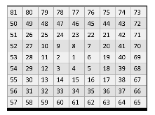
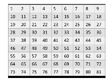

# CellInsight CX7
Scripts to handles CellInsight CX7 High-Content Screening Platformscanner files exported as tiff files

The tiff files are organised as follow:
- time points 1 to 3, FOVs are numbered f01 to f81 (mode time-lapse scan over 3 days because of the weekend)
- time points 4 to 8, FOVs are numbered f00 to 80 (mode single scan)
- the image are vertically flip during the export (they are flipped back during processing in step 3)
- The wells are scanned in spiral: FOV f00 or f01 is at the centre, then left rotating spiral. Stitching plugin in Fiji do not handle spiral, there is no tiles position file with the data

- **step 1:** organise the data by plate>well>time point with [Bulk Rename Utility](https://www.bulkrenameutility.co.uk/){:target="_blank"}. Could write python or imagej script to do it.
- **step 2:** rename the files according to the pattern below with a python script:

- **step 3:** open each time point folder as a stack and make montage with Image>Stack>Make Montage... (imagej macro Make_montage.ijm)
- **step 4:** per plate>well concatenate the 8 time points montage, done manually (could write a script or integrate it into Make_montage.ijm)
- **step 5:** per plate>well, stack are aligned with Correct 3D drift plugin (the stack dimension must be swapped from z=8 to t=8), some stack are aligned 2 images at the time and the results are concatenated into a final t-stack
